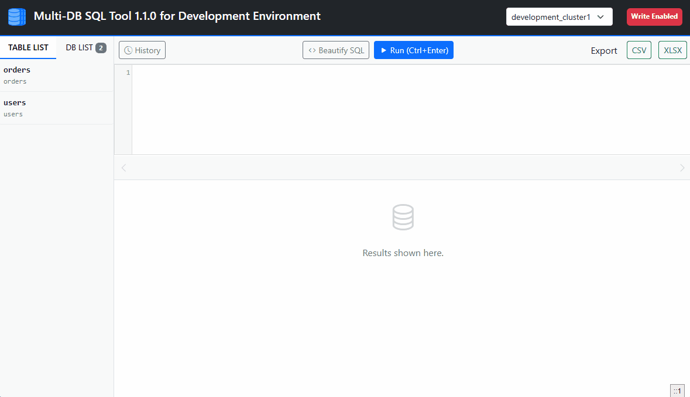

# Multi-DB SQL Tool


SQL execution tool for multiple database or schema environment like sharding architecture.

It must be useful for people that

- have the horizontal-partitioned databases (**shardingj**)
- distriibuted edge databases (**databases on each chain store**)

Demo


## Feature

- Multiple database SQL execution
- SQL editor
- Execution history of SQL
- Display result by grid
- Exporting XLSX (Excel)
- Two modes: read-only and writable

## System Requirements

- PHP 7.0+ (No third-party libraries)
- MySQL 5.7+
- Modern browser

## Installation

1. Put files under `src` directory to your directory.
2. Make `config.php` from `config.samaple.php`, and configure it. (ex. database connection settings)
3. That all.

## How to Develop

Pull this repository.

```bash
# Move to project directory
cd multi-db-sql-tool

# Run docker command
docker-compose up -d --build

# Then you can access the following URL
http://localhost:8080
```

`docker-compose.yml` has the following resources.

- Three databases as sharding-architecture
- Each database has two tables, `users` and `orders`

## Frontend Libraries

- [Normalize.css](https://necolas.github.io/normalize.css/)
- [jQuery](https://jquery.com/) 3.5
- [Bootstrap](https://getbootstrap.com/) 5.3
  - [Bootstrap Icons](https://icons.getbootstrap.com/) 1.13
- [CodeMirror](https://codemirror.net/) 5.56
  - Theme: [eclipse](https://icons.getbootstrap.com/)
- [AG Grid Community](https://www.ag-grid.com/) 31.0
  - Theme: [alpine](https://www.ag-grid.com/javascript-data-grid/themes/#example-built-in-themes)
- [SheetJS](https://sheetjs.com/) xlsx.js 0.18
- [sql-formatter](https://github.com/sql-formatter-org/sql-formatter#readme) 5.6
- [jsDelivr](https://www.jsdelivr.com/) as CDN

## License

MIT License
