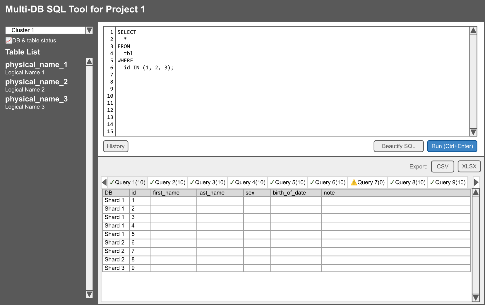

# Multi-DB SQL Tool

## Purpose

Shardingや分散DB環境に対して、同時にSQLを実行するツール。

## Middleware Requirements

- PHP 7.0 later
- MySQL 5.7 later

## Backend Libraries

- Never use third-party libraries, use PHP APIs only

## Frontend Libraries

- Normalize.css ( https://necolas.github.io/normalize.css/ )
  - For reset CSS
- Bootstrap 5.x ( https://getbootstrap.com/ )
  - For base design system
- CodeMirror ( https://codemirror.net/ )
  - For SQL Editor
- SheetJS ( https://qiita.com/tomgoodsun/items/0107e5d778b803935fc0 )
  - For Excel and CSV exporting
- AG Grid ( https://www.ag-grid.com/ ) or Handsontable ( https://handsontable.com/ )
  - For result showing
- SQL Formatter ( https://github.com/sql-formatter-org/sql-formatter )
  - For SQL beautification.

## Coding Styles

- PHP
  - PSR-12
- HTML, CSS, JavaScript
  - Google or Mozilla Developer Network recommendation

## Configuration Sample

```php
<?php
return [
    // Set optional name
    // If this options has text, append "for <Optional Name>" after 'Multi-DB SQL Tool'
    'optional_name' => '',

    // DB targets
    'dbs' => [
        'cluster_1' => [
            'shard1' => ['name' => 'Shard 1', 'host' => '127.0.0.1', 'port' => '3306', 'username' => 'dbuser', 'password' => 'P@ssw0rd', 'dbname' => 'shard1'],
            'shard2' => ['name' => 'Shard 2', 'host' => '127.0.0.1', 'port' => '3307', 'username' => 'dbuser', 'password' => 'P@ssw0rd', 'dbname' => 'shard2'],
            'shard3' => ['name' => 'Shard 3', 'host' => '127.0.0.1', 'port' => '3308', 'username' => 'dbuser', 'password' => 'P@ssw0rd', 'dbname' => 'shard3'],
        ],
    ],

    // Read-only mode
    // true: select, show, describe, desc, explain only
    // false: all queries are available
    'readonly_mode' => true,

    // To enable basic authentication, set ID/password at this option.
    'basic_auth' => [
        //['user', 'password'],
    ],
];
```

## Usability

- Layout
  - Top is title area
  - Left pane is selecting cluster and table lists
  - Right upper pane is SQL editor
  - Right lower pane is results
- SQL editor displays line numbers.
- SQL editor's font must be fixed-width.
- Run SQL with the 'Run' button or Ctrl+Enter.
- Run SQLs are stored in the temporary space, and possible to refer to and restore to SQL editor as history. When restoring, open dialog and the user can select history.
- Clicking 'Beautify' to beautify mess SQLs.
- SQL will be run separated with semi-colons.
- Results are shown in tabs.
- Tab label shows like 'Query 1(10)', query number and the number of found rows.
- The first columns of result tables must be the name of shards (DB).
- Exporting as XLSX downloads XLSX combining results in all tabs converting to sheets.
- Clicking status display the following data in dialog:
  - Connection status
  - Existence of tables on each DB
- When some shards or SQLs have errors, display them in the tab.


