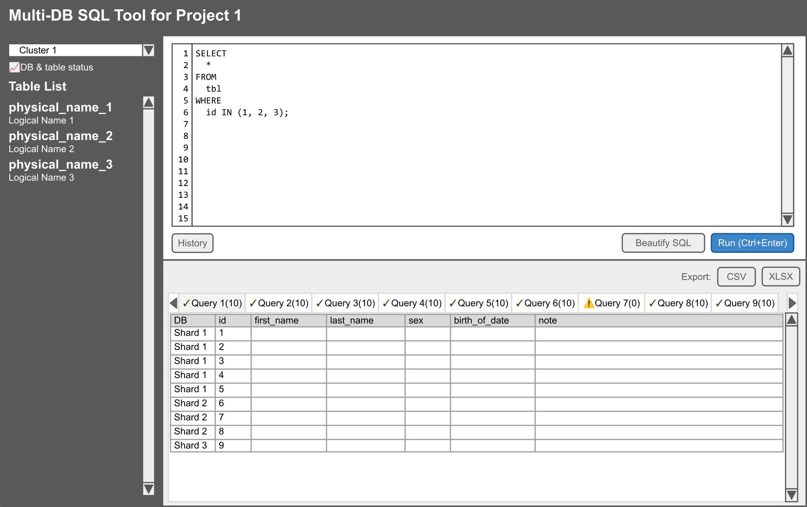

# Multi-DB SQL Tool

## Purpose

Shardingや分散DB環境に対して、同時にSQLを実行するツール。

## Middleware Requirements

- PHP 7.0 later
- MySQL 5.7 later

## Backend Libraries

- Never use third-party libraries, use PHP APIs only

## Frontend Libraries

- Normalize.css ( https://necolas.github.io/normalize.css/ )
  - For reset CSS
- Bootstrap 5.x ( https://getbootstrap.com/ )
  - For base design system
- CodeMirror 6.x ( https://codemirror.net/ )
  - For SQL Editor
- SheetJS ( https://docs.sheetjs.com/ )
  - For Excel and CSV exporting
  - Reference implementation: https://qiita.com/tomgoodsun/items/0107e5d778b803935fc0
- AG Grid Community ( https://www.ag-grid.com/ )
  - For result showing (preferred over Handsontable for licensing)
- SQL Formatter ( https://github.com/sql-formatter-org/sql-formatter )
  - For SQL beautification

## Coding Styles

- PHP
  - PSR-12
- HTML, CSS, JavaScript
  - Google or Mozilla Developer Network recommendation

## Configuration Sample

```php
<?php
return [
    // Set optional name
    // If this options has text, append "for <Optional Name>" after 'Multi-DB SQL Tool'
    'optional_name' => '',

    // DB targets
    'dbs' => [
        'cluster_1' => [
            'shard1' => ['name' => 'Shard 1', 'host' => '127.0.0.1', 'port' => '3306', 'username' => 'dbuser', 'password' => 'P@ssw0rd', 'dbname' => 'shard1'],
            'shard2' => ['name' => 'Shard 2', 'host' => '127.0.0.1', 'port' => '3307', 'username' => 'dbuser', 'password' => 'P@ssw0rd', 'dbname' => 'shard2'],
            'shard3' => ['name' => 'Shard 3', 'host' => '127.0.0.1', 'port' => '3308', 'username' => 'dbuser', 'password' => 'P@ssw0rd', 'dbname' => 'shard3'],
        ],
    ],

    // Read-only mode
    // true: select, show, describe, desc, explain only
    // false: all queries are available
    'readonly_mode' => true,

    // To enable basic authentication, set ID/password at this option.
    'basic_auth' => [
        //['user', 'password'],
    ],

    // Session configuration
    'session' => [
        'name' => 'MDBSQL_SESSION',
        'lifetime' => 86400, // 24 hours
        'max_history' => 50,
    ],

    // Query execution limits
    'limits' => [
        'max_execution_time' => 30,
        'max_rows_per_query' => 10000,
        'max_queries_per_request' => 10,
    ],

    // UI settings
    'ui' => [
        'theme' => 'light', // 'light' or 'dark'
        'editor_theme' => 'default', // CodeMirror theme
        'items_per_page' => 100,
    ],
];
```

## Usability

- Layout
  - Top is title area
  - Left pane has connection status
  - Left pane has 2 tabs, table list and shard/database list
  - Each item of table list shows physical name, logical name, and existence status on databases
  - Database list is selective and only selected database will be target
  - Right upper pane is SQL editor with toolbar (Run, Beautify, History, Clear)
  - Right lower pane is results displayed in tabs
- SQL editor displays line numbers and syntax highlighting
- SQL editor's font must be fixed-width (monospace)
- Run SQL with the 'Run' button or Ctrl+Enter
- Run SQLs are stored in session-based history, accessible via 'History' button
- History dialog allows selection and restoration of previous queries
- 'Beautify' button formats and indents SQL queries
- SQL statements are separated by semicolons and executed sequentially
- Results are displayed in tabs with labels showing query number and row count
- Tab labels format: 'Query `{id}` (`{rows}`)', or 'Query 1 (10)'
- First column of result tables shows shard/database name
- Export functionality creates XLSX file with each tab as a separate worksheet
- Status dialog shows:
  - Connection status for each shard
  - Table existence verification across shards
  - Query execution statistics
- Error handling displays errors in dedicated tabs with detailed information
- No support for responsive design

## Security Considerations

- Basic authentication support for production environments
- Read-only mode enforcement at query parsing level
- SQL injection prevention through prepared statements where applicable
- Session security with configurable timeout
- Input sanitization and output escaping

## Performance Considerations

- Concurrent query execution across shards
- Configurable row limits to prevent memory exhaustion
- Query timeout settings
- Efficient result set handling for large datasets


